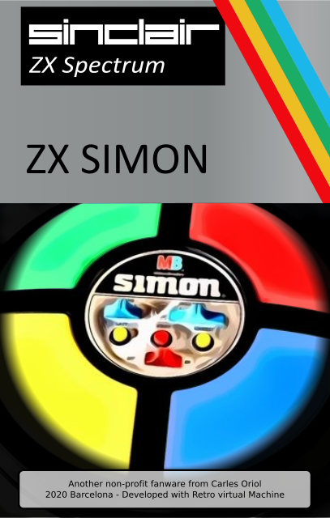

# ZX Simon

ZX Simon is a conversion of the classic MB Simon game to ZX Spectrum 48k.

This fan conversion is done non-profit just for fun.



get it at https://github.com/carlesoriol/zxsimon

1/2/2020 - Version 1.0

by Carles Oriol - Barcelona 2020
carlesoriol@gmail.com


## Why Simon?

Simple: **I hate simon.**

When I was a kid, I never had simon. I played with at my friends homes and I always remember how frustrating it was to lose one time after another. It was upsetting!!

After finishing Parachute, I saw an old simon ad. And I thought... why not? This could be another great z80 assembler / spectrum / attribute game. So I start gathering information.

I was amazed by the great work done by Simon Inns at https://www.waitingforfriday.com/?p=586  wow!!! And then I start loving the game.  Two weekends later ZXSimon was born.

Now I want to share it with you (as always open source and free) so you can lose alone, lose with your friends, lose with your family, out doors, indoors... everywhere you can use a speccy or an emulator you can enjoy this feeling.

## Play

Open tap or tzx file in any ZX Spectrum, FPGA machine or emulator you like.

* Key: **Q** - Green button
* Key: **P** - Red button
* Key: **L** - Cyan button
* Key: **A** - Yellow button

* Key: **1** - Change game mode
* Key: **2** - Change skill level, (number of tones to win 8, 14, 20 or 31)

* Key: **3** - Special Key. Changes Simon tones. (There are several versions of the game so select the one you like)

* Key: **F** - Repeats last sequence
* Key: **M** - Repeats the longest sequence

* Key: **SPACE** - Show help
* Key: **INTRO** - Starts a game


## Compile

- Option A

Assembly with Retro Virtual Machine assembler inside a ZX Spectrum 48k.

```
asm simon.asm

RANDOMIZE USR 32768

(or uncomment last line in simon.asm : run 0x8000)
```

- Option B 

Assembly with pasmo to create Tap files. (Thanks George Phillips for show me on facebook how to align with this assembler)

```
sh make.sh
```

## Tape files

zxsimon.tap - To use in all speccy emulators
zxsimon.tzx - Accelerated tape to use in some emulators like RVM. (Created with OTLA from Francisco Villa Rodriguez. Thanks to Antonio Villena for cargandoleches and the amazing zxuno & zxdos)

## Thanks

* Thanks to Milton Bradley for creating Simon.
* Thanks to Atari for creating the original game "Touch Me" https://en.wikipedia.org/wiki/Touch_Me_(arcade_game)
* Thanks to Sinclair Computers and to Sir Clive Sinclair for creating the ZX Spectrum that gave me my hobby, my passion and my career.
* Thanks to the people of retro virtual machine for creating a so enjoyable environment to develop.
* Thanks to my Nurieta for everything else in my life.

## Contributing

Just made me know if you want to publish any changes or if you have any ideas

## License
[AGPL](https://choosealicense.com/licenses/agpl/)


